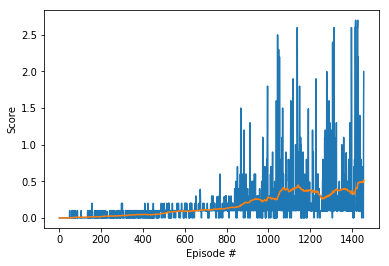

## Project Report

### Learning Algorithm

The learning algorithm used is Multi Agent Deep Deterministic Policy Gradients (MADDPG) with some tweaks and modification. MADDPG is a multi-agent version of DDPG. DDPG is well suited to continuous control tasks and this just extends it to a multi-agent scenario. The algorithm consists of 2 separate agents each with set of 2 neural networks - actor and critic. The actor network takes observation as an input and outputs actions. The critic network is used to compute state-action values. It outputs 1 real number - state value estimate for the given agent. It takes actions and observations from each agent as an input.

Agents share a common experience replay buffer which contains tuples with states and actions from all agents. Each agent does its own sampling from this replay buffer. This allows agents to learn their own reward function and incorporate the actions of other agents in their learning. Therefore, we can train them in collaborative, competitive, or mixed environments. More details can be found in the MADDPG paper.

### Model Architecture and Hyperparameters

The Udacity provided DDPG code in PyTorch was adapted to employ two agents acting independently, but with a shared experience buffer. Each agent has its own set of deep neural networks (local and target actors and critics), each with two hidden layers of 256-128 nodes, with ReLU activation functions on the hidden layers and tanh on the output layers. The agents shared one experience memory buffer.

A learning rate of 1e-3 on each DNN and batch size of 128 were used along with replay buffer size of 500000, gamma .99 and Tau of 6e-2. Each agent took two steps, then learned once, then repeated. After optimizing these hyperparameters, the agents were learning and achieving the desired goal of a 0.5 average reward. However, the agents took several hundred episodes to gain traction and start playing effectively.

### Results

Utilizing the MADDPG algorithm with the above hyperparameters the agents achieved the average score of 0.5 in 1455 episodes. I trained the agent with model of two hidden layers of 400-300 nodes(as given in Udacity's repo) but training was very slow. For the objective of this project, the model produced a satisfactory result. However, as noted by Udacity in its own training and similarly found in my training, the agents are not stable or reliable if trained further. If you allow them to continue playing, they vary considerably episode to episode in the reward attained. 

### Future work

- Hyperparameter tuning - I focused on tuning hidden size and learning rate which gave major improvements. Other parameters would probably impact learning 
- Experimenting with different model architectures and other combinations of hyperparameters
- Experiment with other environments such as Soccer(Unity)

### References 

* [Multi-Agent Actor-Critic for Mixed Cooperative-Competitive Environments.](https://arxiv.org/abs/1706.02275)
* https://pemami4911.github.io/blog/2016/08/21/ddpg-rl.html
* https://github.com/udacity/deep-reinforcement-learning/tree/master/ddpg-bipedal